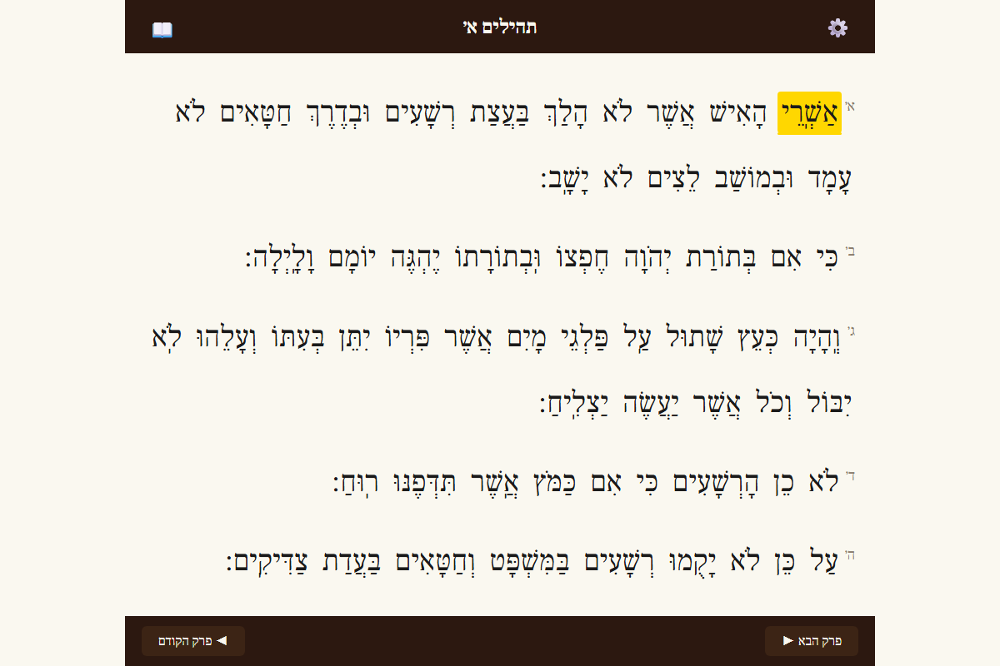
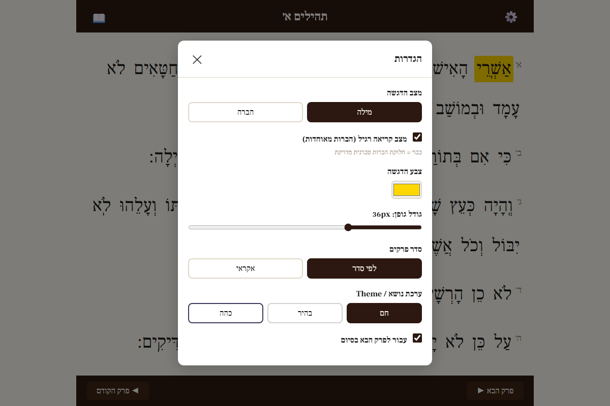

# Tehillim Reader — קורא תהילים

A Hebrew reading helper for Tehillim (Psalms) with word/syllable highlighting.

Built for reading Tehillim with kids — highlights the current word or syllable as you navigate through the text using keyboard, mouse, or scroll wheel.





## Features

- 📖 All 150 Psalms with full nikud (vowel points)
- 🔤 **Word mode**: highlights entire words
- 🔡 **Syllable mode**: highlights individual syllables (powered by [havarotjs](https://github.com/charlesLoder/havarotjs))
- 📚 **Reading mode toggle**: casual (merged syllables) vs Tiberian (academic) pronunciation
- 🎨 Configurable highlight color
- 🌗 Three themes: warm (parchment), light, and dark
- ⌨️ Keyboard navigation (arrow keys, space, enter)
- 🖱️ Click-to-jump and scroll wheel navigation
- 📱 Responsive design for tablet reading
- 💾 Settings persisted in localStorage

## Navigation

| Input | Action |
|-------|--------|
| ← Left arrow / Space | Next word/syllable (forward in Hebrew) |
| → Right arrow | Previous word/syllable |
| ↓ Down arrow | Next verse |
| ↑ Up arrow | Previous verse |
| Scroll wheel | Forward/backward |
| Click on word | Jump to that word |
| Enter | Next verse |
| Home/End | Beginning/end of chapter |

## Development

```bash
npm install
npm run dev        # Start dev server
npm run build      # Production build
npm run fetch-data # Re-fetch Tehillim data from Sefaria API
```

## Tech Stack

- **Vite** + **TypeScript** (vanilla, no framework)
- **havarotjs** for Hebrew syllable breakdown
- **Sefaria API** for Tehillim text (pre-fetched and bundled)
- **GitHub Pages** for hosting

## License

ISC
